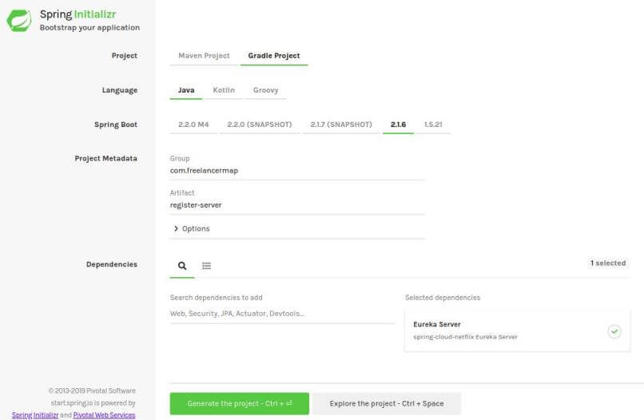
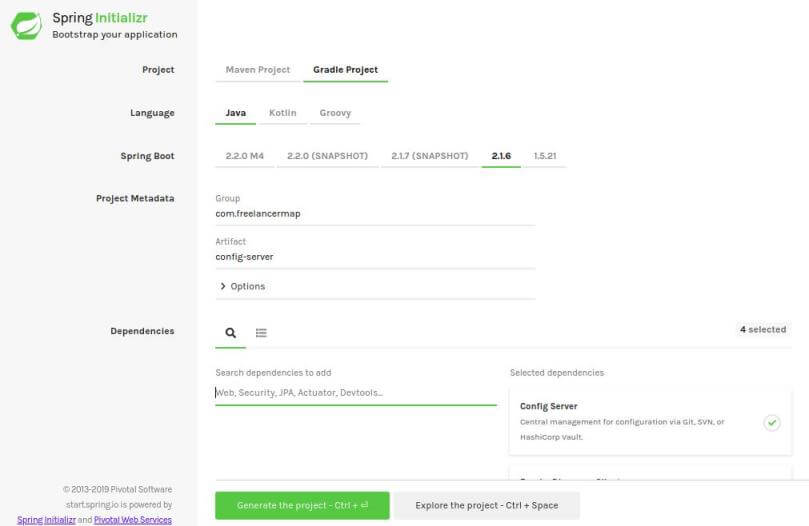
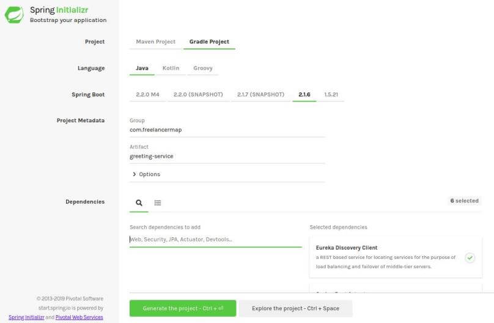

<div align="center">
  
</div>


# Nombre: Rodriguez de León Ricardo Emmanuel

<h1 align="center"> A Netflix guide to Microservices. </h1>

# Indice

* [Introducción](#introducción)

* [Contenido](#contenido)

* [Conclusion](#conclusion)

* [Bibliografia](#bibliografia)

# Introduccion
La arquitectura de microservicios ha ganado gran popularidad en los últimos tiempos. Con ella se logra conseguir simplicidad en nuestros servicios y así se garantiza un mantenimiento menos complejo. Hoy, Will Manuel Leyton, nos muestra la implementación de microservicios con Spring Cloud y Spring Cloud Netflix.

# Contenido
Se hablara de como se puede implementar microservicios con los tacks de Spring Cloud y Spring Cloud Netflix, el cual encapsula los componentes más populares de Netflix OSS y se integra con aplicaciones Spring Boot.

### Pre - requisitos
1. Java >= 8.
2. Git.
3. Gradle.
4. Conocimiento en Spring Boot.
5. Cuenta GitHub
6. IDE para Java (Eclipse, IntellIJ, etc).
7. Lombok
8. Internet.

# Desarrollo de Service Registry con Eureka
El patrón service registry permite que los diferentes servicios e instancias se registren en un servidor que actúa como una base de datos, la cual es consultada mediante un API y se logra descubrir instancias basados en un identificador, Eureka es un servidor de registro diseñado por Netflix OSS.

Para desarrollar el servidor eureka debemos seguir los siguientes pasos:

    1. Dirigirnos a Spring initializr: https://start.spring.io
    
    2. Crear proyecto register-server con las siguientes especificaciones:



Donde seleccionaremos las dependencias: Eureka Server, Actuator y DevTools y luego daremos click en botón Generate Project, lo cual descargara un proyecto.

    3. Importar Proyecto gradle en nuestro IDE.
    
    4. Anotar clase lanzadora RegisterServerApplication con @EnableEurekaServer para habilitar un servidor de registro:

```

@EnableEurekaServer
@SpringBootApplication
public class RegisterServerApplication {
 
    public static void main(String[] args) {
        SpringApplication.run(RegisterServerApplication.class, args);
    }
}

```

    5. Renombrar archivo application.properties por bootstrap.yml y agregar:


```

server:
  port: ${EUREKA_PORT:8761}
 
spring:
  application:
    name: register-server
  
eureka:
  client:
    register-with-eureka: false
    fetch-registry: false

```

Donde se configura el puerto, el nombre de la aplicación y el no registro en el servidor de registro.

# Desarrollar Configuration Server con Spring Cloud Config

El patrón externalized configuration permite externalizar toda la configuración de las aplicaciones, como las credenciales, etc.

Spring Cloud Config Server es un servidor que permite externalizar la configuración basada en archivos de propiedades en repositorios git, base de datos, etc.

Para desarrollar el servidor de configuración debemos seguir los siguientes pasos:

    1. Crear repositorio config-repo en GitHub, GitLab, etc.
    
    2. Agregar archivo application.yml en config-repo, el cual servirá como configuración global para todos los microservicios conectados al servidor de configuración y agregar la siguiente configuración:

```
eureka:
  client:
    service-url:
      defaultZone: ${EUREKA_URI:http://localhost:${EUREKA_PORT:8761}/eureka}
    register-with-eureka: true
```

    3. Realizar commit y push para empujar los cambios al repositorio remoto de GitHub.
    
    4. Dirigirnos a spring initializr: https://start.spring.io
    
    5.Crear proyecto config-server con las siguientes especificaciones:



    6. Donde seleccionaremos las dependencias: Config Server, Eureka Discovery Client, Actuator y DevTools y luego daremos click en botón Generate Project, lo cual descargara un proyecto.
    
    7. Importar Proyecto gradle en nuestro IDE.
    
    8. Anotar clase lanzadora ConfigServerApplication con @EnableDiscoveryClient  para habilitar la funcionalidad de cliente del servidor de registro Eureka:

```
@EnableConfigServer
@EnableDiscoveryClient
@SpringBootApplication
public class ConfigServerApplication {
 
    public static void main(String[] args) {
        SpringApplication.run(ConfigServerApplication.class, args);
    }
}

```

    1. Renombrar archivo application.properties por bootstrap.yml y agregar:

```
server:
  port: ${CONFIG_PORT:8888}
 
spring:
  application:
    name: config-server
  cloud:
    config:
      server:
        git:
          uri: ${CONFIG_REPO_URI}
          username: ${CONFIG_REPO_USERNAME}
          password: ${CONFIG_REPO_PASSWORD}
  
eureka:
  client:
    service-url:
      defaultZone: ${EUREKA_URI:http://localhost:${EUREKA_PORT:8761}/eureka}
    register-with-eureka: true

```
Donde se configura el puerto, nombre de la aplicación, servidor de registro, el servidor de configuración basado en su application name y las credenciales del repositorio, el cual brindará los archivos de configuración.

La variable de entorno ${CONFIG_REPO_URI} es la url http del repositorio config-repo creado en GitHub, ${CONFIG_REPO_USERNAME} y ${CONFIG_REPO_PASSWORD} son las credenciales para acceder al repositorio.

# Desarrollar Microservicios

Desarrollaremos un microservicio que exponga un controlador que devuelva un saludo, el cual se registrará en el register-server y buscará su configuración en config-server. Para desarrollar el microservicio debemos seguir los siguientes pasos:

    1. Agregar archivo greeting-service.yml en config-repo, el cual servirá como configuración en el perfil default para el microservicio greeting-service y agregar la siguiente configuración:

```
greeting:
message: Hello
```
    2. Realizar commit y push para empujar los cambios al repositorio remoto de GitHub.
    
    3. Dirigirnos a spring initializr: https://start.spring.io 
    
    4. Crear proyecto greeting-service con las siguientes especificaciones:



    5. Donde seleccionaremos las dependencias: Eureka Discovery Client, Config Client, Web, Lombok, Actuator y DevTools y luego daremos click en botón Generate Project, lo cual descargara un proyecto.
    
    6. Importar Proyecto gradle en nuestro IDE.
    
    7.Anotar clase lanzadora GreetingServiceApplication con @EnableDiscoveryClient  para habilitar la funcionalidad de cliente del servidor de registro Eureka:

```
@EnableDiscoveryClient
@SpringBootApplication
public class GreetingServiceApplication {
 
    public static void main(String[] args) {
        SpringApplication.run(GreetingServiceApplication.class, args);
    }
}

```

    8. Renombrar archivo application.properties por bootstrap.yml y agregar:

```
server:
  port: ${GREETING_PORT:8080}
 
spring:
  application:
    name: greeting-service
  cloud:
    config:
      discovery:
        enabled: true
        service-id: config-server

```

    1. Crear paquete dto y agregar clase GreetingResponse:

```
@Getter
@Setter
@NoArgsConstructor
@AllArgsConstructor
public class GreetingResponse {
 
    private String message;
}

```

    10. Crear paquete service.inter y agregar interface GreetingService:

```
public interface GreetingService {
 
    GreetingResponse greeting(String name);
}
```

    11. Crear paquete service.impl y agregar implementación GreetingServiceImp:

```
@Service
public class GreetingServiceImp implements GreetingService {
 
    @Value(
            value = «${greeting.message}»)
    String baseMessage;
 
    @Override
    public GreetingResponse greeting(String name) {
        String message = baseMessage + » « + name;
        return new GreetingResponse(message);
    }
}

```

    Crear paquete controller y agregar interface GreetingController:

```
@RestController
@AllArgsConstructor
@RequestMapping(
        value = {
            «/greeting»
        })
public class GreetingController {
 
    private GreetingService greetingService;
 
    @GetMapping
    public ResponseEntity<GreetingResponse> greeting(@RequestParam(
            value = «name») String name) {
        return ResponseEntity.ok(greetingService.greeting(name));
    }
}
```

# Conclusion
Destaca la utilidad y eficacia de las herramientas proporcionadas por Spring Cloud y Spring Cloud Netflix para la implementación de microservicios. Resalta que estas tecnologías simplifican la construcción de arquitecturas basadas en microservicios al proporcionar soluciones para patrones comunes como el registro de servicios, la gestión de configuración externa, la creación de puertas de enlace API, la tolerancia a fallos y la trazabilidad distribuida.

A pesar de que se esta hablando de como se crea y al ser un ejemplo, este mismo requiere de que se complete, ya que en si solo se queria mostrar lo mas basico que pide para poder crear un microservicio con las herramientas proporcionadas.

# Bibliografia

Leyton, W. M. (2022, 27 octubre). Cómo Crear Microservicios con Spring Cloud y Spring Cloud Netflix. Freelancer Blog. https://www.freelancermap.com/blog/es/microservicios-spring-cloud-netflix/
