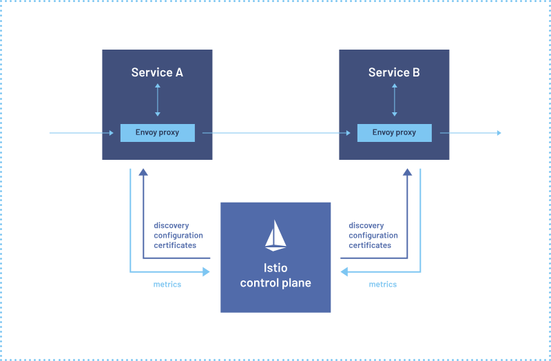
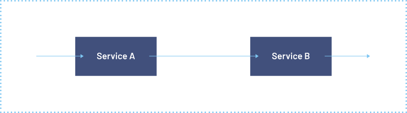

  

# Nombre: Rodriguez de León Ricardo Emmanuel

<h1 align="center"> Istio </h1>

# Indice

* [Introducción](#introducción)

* [Contenido](#contenido)

* [Conclusion](#conclusion)

* [Bibliografia](#bibliografia)

# Introduccion
Se vera lo que es Istio, para que es y como se puede aplicar

# Contenido
Istio aborda los desafíos que enfrentan los desarrolladores y operadores con una arquitectura distribuida o de microservicios. Ya sea que esté creando desde cero o migrando aplicaciones existentes a la nube nativa, Istio puede ayudarlo.

## ¿Qué es una malla de servicios?
Las aplicaciones modernas suelen diseñarse como colecciones distribuidas de microservicios, y cada colección de microservicios realiza alguna función empresarial discreta. Una malla de servicios es una capa de infraestructura dedicada que puede agregar a sus aplicaciones. Le permite agregar de forma transparente capacidades como observabilidad, gestión del tráfico y seguridad, sin agregarlas a su propio código. El término "malla de servicio" describe tanto el tipo de software que se utiliza para implementar este patrón como la seguridad o el dominio de red que se crea cuando se utiliza ese software.

A medida que la implementación de servicios distribuidos, como en un sistema basado en Kubernetes, crece en tamaño y complejidad, puede volverse más difícil de entender y gestionar. Sus requisitos pueden incluir descubrimiento, equilibrio de carga, recuperación de fallas, métricas y monitoreo. Una malla de servicios también suele abordar requisitos operativos más complejos, como pruebas A/B, implementaciones canary, limitación de velocidad, control de acceso, cifrado y autenticación de extremo a extremo.

La comunicación de servicio a servicio es lo que hace posible una aplicación distribuida. Enrutar esta comunicación, tanto dentro como entre grupos de aplicaciones, se vuelve cada vez más complejo a medida que crece el número de servicios. Istio ayuda a reducir esta complejidad y al mismo tiempo alivia la presión sobre los equipos de desarrollo.

## ¿Qué es Istio?
Istio es una malla de servicios de código abierto que se superpone de forma transparente a las aplicaciones distribuidas existentes. Las potentes funciones de Istio brindan una forma uniforme y más eficiente de proteger, conectar y monitorear servicios. Istio es el camino hacia el equilibrio de carga, la autenticación y la supervisión de servicio a servicio, con pocos o ningún cambio en el código de servicio. Su poderoso plano de control trae características vitales, que incluyen:

* Comunicación segura entre servicios en un clúster con cifrado TLS, autenticación y autorización sólidas basadas en identidad
* Equilibrio de carga automático para tráfico HTTP, gRPC, WebSocket y TCP
* Control detallado del comportamiento del tráfico con reglas de enrutamiento enriquecidas, reintentos, conmutaciones por error e inyección de fallas
*Una capa de políticas conectable y una API de configuración que admiten controles de acceso, límites de velocidad y cuotas.
* Métricas, registros y seguimientos automáticos para todo el tráfico dentro de un clúster, incluida la entrada y salida del clúster.

## ¿Cómo funciona?
Istio tiene dos componentes: el plano de datos y el plano de control.

El plano de datos es la comunicación entre servicios. Sin una malla de servicios, la red no comprende el tráfico que se envía y no puede tomar ninguna decisión en función del tipo de tráfico que es, de quién o hacia quién.

Service Mesh utiliza un proxy para interceptar todo el tráfico de su red, lo que permite un amplio conjunto de funciones compatibles con las aplicaciones según la configuración que establezca.

Se implementa un proxy Envoy junto con cada servicio que inicia en su clúster o se ejecuta junto con los servicios que se ejecutan en las máquinas virtuales.

El plano de control toma la configuración deseada y su vista de los servicios, y programa dinámicamente los servidores proxy, actualizándolos a medida que cambian las reglas o el entorno.

Antes de utilizar Istio

## Conceptos
### La gestión del tráfico
El enrutamiento del tráfico, tanto dentro de un único clúster como entre clústeres, afecta el rendimiento y permite una mejor estrategia de implementación. Las reglas de enrutamiento de tráfico de Istio le permiten controlar fácilmente el flujo de tráfico y las llamadas API entre servicios. Istio simplifica la configuración de propiedades de nivel de servicio, como disyuntores, tiempos de espera y reintentos, y facilita la configuración de tareas importantes como pruebas A/B, implementaciones canary e implementaciones por etapas con divisiones de tráfico basadas en porcentajes.

### Observabilidad
A medida que los servicios crecen en complejidad, resulta difícil comprender el comportamiento y el rendimiento. Istio genera telemetría detallada para todas las comunicaciones dentro de una malla de servicios. Esta telemetría proporciona observabilidad del comportamiento del servicio, lo que permite a los operadores solucionar problemas, mantener y optimizar sus aplicaciones. Aún mejor, obtienes casi toda esta instrumentación sin necesidad de realizar cambios en la aplicación. A través de Istio, los operadores obtienen una comprensión profunda de cómo interactúan los servicios monitoreados.

La telemetría de Istio incluye métricas detalladas, seguimientos distribuidos y registros de acceso completo. Con Istio, obtiene una observabilidad exhaustiva y completa de la malla de servicios.

### Capacidades de seguridad
Los microservicios tienen necesidades de seguridad particulares, incluida la protección contra ataques de intermediarios, controles de acceso flexibles, herramientas de auditoría y TLS mutuo. Istio incluye una solución de seguridad integral para brindar a los operadores la capacidad de abordar todos estos problemas. Proporciona identidad sólida, políticas potentes, cifrado TLS transparente y herramientas de autenticación, autorización y auditoría (AAA) para proteger sus servicios y datos.

El modelo de seguridad de Istio se basa en la seguridad por defecto, con el objetivo de proporcionar una defensa en profundidad que le permita implementar aplicaciones orientadas a la seguridad incluso en redes no confiables.

# Conclusion
Istio nos ayuda a conectar, asegurar y controlar el trafico entre los servicios de una aplicacion en un entorno de contenedores y microservicios, por ejemplo en Kubernetes o Docker. Ademas de que nos proporciona una capa de servicios de red que nos permite la gestion del trafico, seguridad, la monitorizacion entre otras funciones de Kubernetes u otros sistemas de orquestacion de contenedores.

# Bibliografia
The Istio service mesh. (s. f.). Istio. https://istio.io/latest/about/service-mesh/