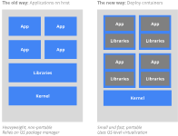
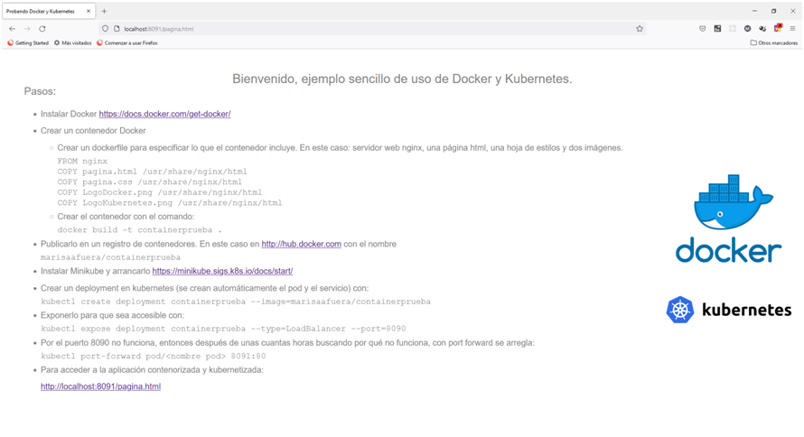
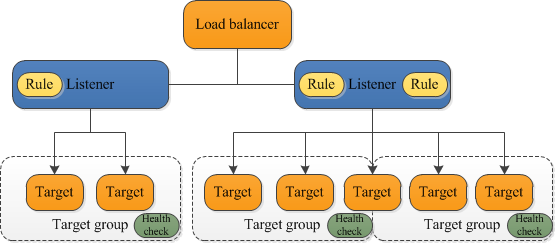

<div align="center">
  
</div>


# Nombre: Rodriguez de León Ricardo Emmanuel

<h1 align="center"> Kubernetes </h1>

# Indice

* [Introducción](#introducción)

* [Contenido](#contenido)

* [Conclusion](#conclusion)

* [Bibliografia](#bibliografia)

# Introduccion
En esta actividad se vera que es, como funciona, asi como Ingress y Loadbalancer.

# Contenido

## Kubernetes
Es una plataforma portable y extensible de codigo abierto para administrar cargas de trabajo y servicios, ademas nos facilita la automatizacion y la configuracion declarativa. Tiene ecosistema grande y rapido crecimiento.

### Caracteristicas
Tiene varias caracteristicas:
1. Plataforma de contenedores
2. Plataforma de microservicios
3. Plataforma portable de nube

Kubernetes ofrece un entorno de administracion centrado en contenedores. Kubernetes orquesta la infraestructura de computo, redes y almacenamiento para que las cargas de trabajo de los usuarios no tengan que hacerlo.

### ¿Por qué usar contenedores?




La Manera Antigua de desplegar aplicaciones era instalarlas en un servidor usando el administrador de paquetes del sistema operativo. La desventaja era que los ejecutables, la configuración, las librerías y el ciclo de vida de todos estos componentes se entretejían unos a otros. Podíamos construir imágenes de máquina virtual inmutables para tener rollouts y rollbacks predecibles, pero las máquinas virtuales son pesadas y poco portables.

En resumen, los beneficios de usar contenedores incluyen:

1. Ágil creación y despliegue de aplicaciones: Mayor facilidad y eficiencia al crear imágenes de contenedor en vez de máquinas virtuales
2. Desarrollo, integración y despliegue continuo: Permite que la imagen de contenedor se construya y despliegue de forma frecuente y confiable, facilitando los rollbacks pues la imagen es inmutable
3. Separación de tareas entre Dev y Ops: Puedes crear imágenes de contenedor al momento de compilar y no al desplegar, desacoplando la aplicación de la infraestructura
4. Observabilidad No solamente se presenta la información y métricas del sistema operativo, sino la salud de la aplicación y otras señales
5. Consistencia entre los entornos de desarrollo, pruebas y producción: La aplicación funciona igual en un laptop y en la nube
6. Portabilidad entre nubes y distribuciones: Funciona en Ubuntu, RHEL, CoreOS, tu datacenter físico, Google Kubernetes Engine y todo lo demás
8. Administración centrada en la aplicación: Eleva el nivel de abstracción del sistema operativo y el hardware virtualizado a la aplicación que funciona en un sistema con recursos lógicos
9. Microservicios distribuidos, elásticos, liberados y débilmente acoplados: Las aplicaciones se separan en piezas pequeñas e independientes que pueden ser desplegadas y administradas de forma dinámica, y no como una aplicación monolítica que opera en una sola máquina de gran capacidad
10. Aislamiento de recursos: Hace el rendimiento de la aplicación más predecible
11. Utilización de recursos: Permite mayor eficiencia y densidad

## Ingress

### Terminología
Para mayor claridad, esta guía define los siguientes términos:

* Nodo: Una máquina worker en Kubernetes, parte de un clúster.
* Clúster: Un conjunto de Nodos que ejecutan aplicaciones en contenedores, administrados por Kubernetes. Para este ejemplo, y para los despliegues más comunes de Kubernetes, los nodos en el clúster no son parte del internet público.
* Enrutador Edge: un enrutador que refuerza la política de seguridad del cortafuegos para tu clúster. Esto podría ser una puerta de entrada administrada por un proveedor de la nube o una pieza física de hardware.
* Red del clúster: un conjunto de enlaces, lógicos o físicos, que facilitan la comunicación dentro de un clúster de acuerdo con el modelo de redes de Kubernetes.
* Service: Un Service que identifica un conjunto de Pods que utilizan selectores de label. A menos que se indique de otra manera, los Services se asumen que tienen IPs virtuales que solo se pueden enrutar dentro de la red del clúster.

## Ejemplo Kubernetes
Se crea un contenedor que incluye un servidor web nginx que muestra una página html.

1. Instalar Docker https://docs.docker.com/get-docker/
2. Crear un contenedor Docker
    * Crear un contenedor Docker que incluye: un servidor web nginx, una página html, una hoja de estilos y dos imágenes. Para construir un contenedor hay que crear un fichero con nombre dockerfile que describe su contenido. En el caso del ejemplo:
    
    ```
    FROM nginx
    COPY pagina.html /usr/share/nginx/html
    COPY pagina.css /usr/share/nginx/html
    COPY LogoDocker.png /usr/share/nginx/html
    COPY LogoKubernetes.png /usr/share/nginx/html
    ```

    * En el directorio donde está el dockerfile se ejecuta el comando para crear el contenedorcon el comando:
    docker build -t containerprueba .

3. Se publica en un registro de contenedores, para luego usarlo desde kubernetes. En este caso en: http://hub.docker.com con el nombre
marisaafuera/containerprueba
4. Instalar Minikube https://minikube.sigs.k8s.io/docs/start/ y arrancarlo. Minikube es una herramienta que administra maquinas virtuales en donde corre una instancia de Kubernetes en un solo nodo y es útil a efectos de aprendizaje y pruebas.
5. Crear un deployment en kubernetes (se crean automáticamente el pod y el servicio) con el comando:
kubectl create deployment containerprueba --image=marisaafuera/containerprueba
6. Exponerlo en Kubernetes para que sea accesible con:
kubectl expose deployment containerprueba --type=LoadBalancer --port=8090
7. Ahora debería de funcionar http://localhost:8090/pagina.html, pero no funciona. Después de unas cuantas horas buscando por qué no funciona, al final con port forward funciona:
kubectl port-forward pod/<nombre pod> 8091:80
8. Para acceder a la aplicación contenorizada y kubernetizada:
http://localhost:8091/pagina.html


### ¿Qué es un Ingress?
Un Ingress expone rutas HTTP y HTTPS desde el exterior del clúster a los servicios dentro del clúster. El control del tráfico es controlado por las reglas definidas en el recurso Ingress.

Ejemplo:


Un Ingress se puede configurar para otorgar URLs a los Services que son accesibles desde el exterior, para hacer balance de cargas del tráfico, finalizar SSL/TLS y ofrecer alojamiento virtual basado en nombres.

Un controlador de Ingress es responsable de complementar el Ingress, comúnmente con un balanceador de cargas, aunque también puedes configurar tu enrutador edge con frontends adicionales para ayudar a manejar el tráfico.

Un Ingress no expone puertos o protocolos arbitrariamente. Exponer servicios distintos de HTTP o HTTPS al internet usa un servicio de tipo Service.Type=NodePort o Service.Type=LoadBalancer.

### Prerrequisitos

Debes tener un controlador de Ingress para satisfacer a un Ingress. Crear únicamente un recurso Ingress no tiene ningún efecto.

Puede que necesites desplegar un controlador Ingress controller tal como el ingress-nginx. Puedes elegir de un número de controladores de Ingress.

Idealmente, todos los controladores de Ingress deberían encajar con la especificación de referencia. En realidad, los distintos controladores de Ingress operan ligeramente diferente.

### El recurso Ingress
Ejemplo de recurso Ingress:
```
apiVersion: networking.k8s.io/v1
kind: Ingress
metadata:
  name: minimal-ingress
  annotations:
    nginx.ingress.kubernetes.io/rewrite-target: /
spec:
  ingressClassName: nginx-example
  rules:
  - http:
      paths:
      - path: /testpath
        pathType: Prefix
        backend:
          service:
            name: test
            port:
              number: 80
```

Un Ingress necesita los campos apiVersion, kind, metadata y spec. El nombre del objeto Ingress debe ser un nombre de subdominio DNS válido. Para información general sobre cómo trabajar con archivos de configuración, mira desplegando aplicaciones, configurando contenedores, administrando recursos.

## LoadBalancer
EL Load Balancer, puede equilibrar la carga del tráfico entre los servidores para ayudar a mejorar el tiempo de actividad. También puede escalar fácilmente sus aplicaciones agregando o eliminando servidores, con una interrupción mínima de sus flujos de tráfico.

### ¿Qué es un Equilibrador de carga de aplicación?
Elastic Load Balancing distribuye automáticamente el tráfico entrante entre varios destinos, por ejemplo, instancias EC2, contenedores y direcciones IP en una o varias zonas de disponibilidad. Monitorea el estado de los destinos registrados y enruta el tráfico solamente a destinos en buen estado. Elastic Load Balancing escala el equilibrador de carga a medida que el tráfico entrante va cambiando con el tiempo. Puede escalarse automáticamente para adaptarse a la mayoría de las cargas de trabajo.
Elastic Load Balancing admite los siguientes equilibradores de carga: equilibradores de carga de aplicaciones, Equilibradores de carga de red, equilibradores de carga de puerta de enlace y Equilibradores de carga clásicos. Puede seleccionar el tipo de equilibrador de carga que mejor se adapte a sus necesidades.

### Componentes del Equilibrador de carga de aplicación
Un equilibrador de carga actúa como único punto de contacto para los clientes. El equilibrador de carga distribuye el tráfico entrante de aplicaciones entre varios destinos, tales como instancias EC2, en varias zonas de disponibilidad. Esto aumenta la disponibilidad de la aplicación. Puede agregar uno o varios oyentes al equilibrador de carga.

Un oyente comprueba las solicitudes de conexión de los clientes mediante el protocolo y el puerto configurados. Las reglas que defina para un oyente determinan cómo el equilibrador de carga va a direccionar las solicitudes a sus destinos registrados. Cada regla consta de una prioridad, una o más acciones y una o más condiciones. Cuando se cumplen las condiciones de una regla, se llevan a cabo sus acciones. Debe definir una regla predeterminada para cada oyente y, si lo desea, puede definir reglas adicionales.

Cada grupo de destino direcciona las solicitudes a uno o varios destinos registrados (tales como instancias EC2) utilizando el protocolo y el número de puerto que ha especificado. Puede registrar un destino en varios grupos de destino. Puede configurar las comprobaciones de estado de cada grupo de destino. Las comprobaciones de estado se llevan a cabo en todos los destinos registrados en un grupo de destino especificado en la regla del oyente del equilibrador de carga.

Ejemplo:


# Conclusion
Cada uno de los temas que se vieron tienen algo muy importante, ademas de que a como lo entendi se complementan unos a otros, ya que los Kubernetes sirven para administrar los trabajos y los servicios, ademas de que nos ayuda a la automatizacion, mientras que Ingress es una API, que administra el acceso externos a los servicios en un cluster, y por ultimo esta el Load Balancer que nos ayuda a tener un equilibrio para la carga del trafico entre servidores y esto nos permite mejorar el tiempo de actividad.

# Bibliografia
    ¿Qué es Kubernetes? (2022, 17 julio). Kubernetes. https://kubernetes.io/es/docs/concepts/overview/what-is-kubernetes/

    Ingress. (2024, 10 marzo). Kubernetes. https://kubernetes.io/es/docs/concepts/services-networking/ingress/

    Load Balancer | IBM. (s. f.). https://www.ibm.com/mx-es/products/load-balancer
    